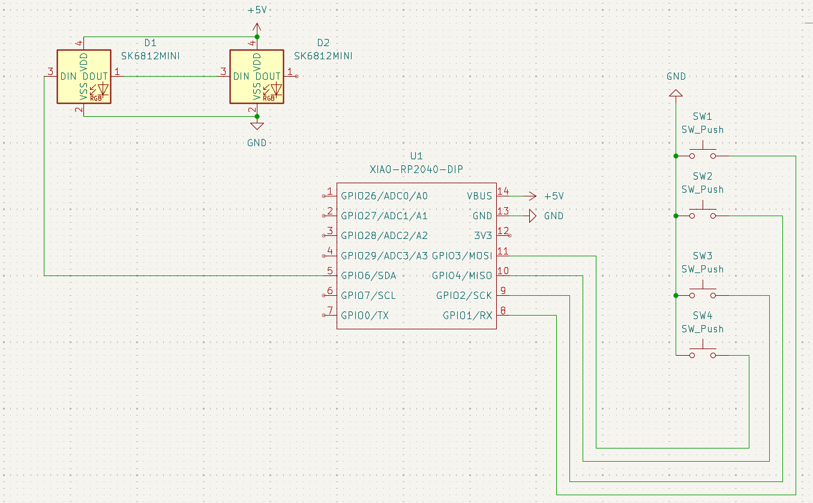
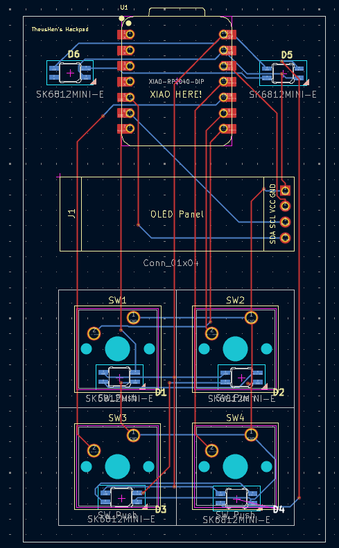
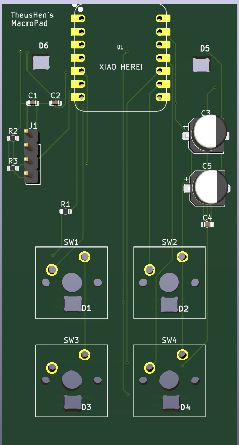

# Hackpad (Hack Club)

A compact, four-key Hackpad built around the Seeed XIAO RP2040 with six SK6812 Mini(-E) addressable RGB LEDs and an optional I²C OLED (SSD1306). The project focuses on a clean, minimal layout with a simple 1u key grid, under-key RGB lighting, and a snug, layered case.

## Screenshots

### Schematic

### PCB

### 3D PCB

### Case Fit
### Being Updated..

## BOM (Bill of Materials)

### Being Updated..

## Notes

* The PCB is designed for 4 standard MX-style switches (1u each).
* Lighting uses **six** SK6812 Mini(-E) addressable RGB LEDs (daisy-chained).
* The PCB includes a **4-pin I²C OLED header** (3V3, GND, SDA, SCL) for an SSD1306-style display.
* The case image shows how the layers align and fit together.