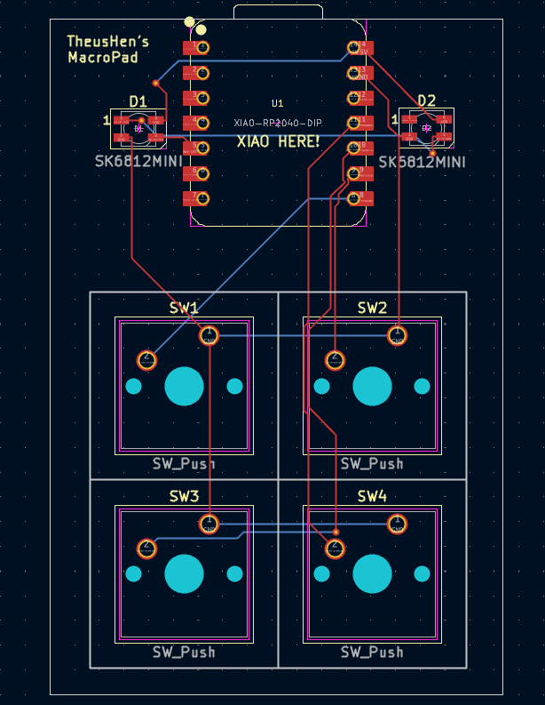

# Hackpad (Hack Club)

A compact, four-key Hackpad built around the Seeed XIAO RP2040 and SK6812 Mini LEDs. This project focuses on a clean, minimal layout with a simple 1u key grid and a snug, layered case.

## Screenshots

### Overall Hackpad

### Schematic

### PCB

### Case Fit

## BOM (Bill of Materials)

| Sourced | Placed | References | Value | Footprint | Quantity |
| --- | --- | --- | --- | --- | --- |
|  |  | D1, D2 | SK6812MINI | LED_SK6812MINI_PLCC4_3.5x3.5mm_P1.75mm | 2 |
|  |  | U1 | XIAO-RP2040-DIP | XIAO-RP2040-DIP | 1 |
|  |  | SW1, SW2, SW3, SW4 | SW_Push | SW_Cherry_MX_1.00u_PCB | 4 |

## Notes

- The PCB is designed for 4 standard MX-style switches (1u each).
- Lighting uses two SK6812 Mini addressable LEDs.
- The case image shows how the layers align and fit together.
